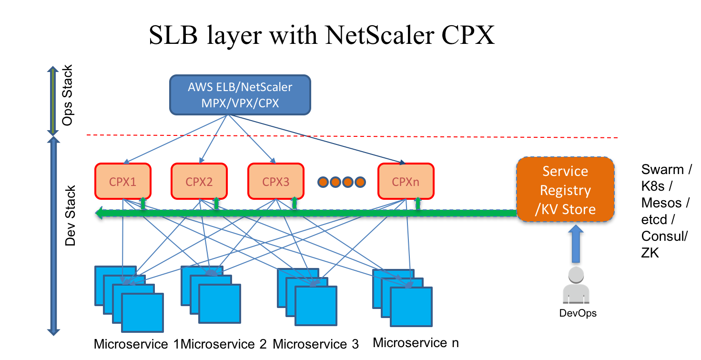
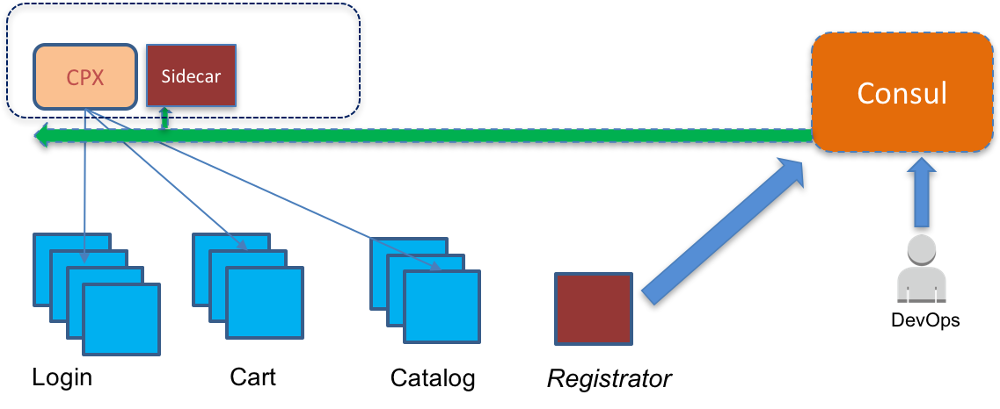

# Demo of Citrix NetScaler CPX configuration driven from Consul
Developers need control at layer 7 for the ingress traffic for their application. Either their load balancer (AWS ELB) doesn't have all the features (routing / filtering / auth / redirection) or their ops team controls a very capable load balancer (NetScaler MPX) that cannot be configured by developers. One solution is to operate a second layer of load balancing ("Software LB or SLB) under developer control. This can be for example using [Netflix Zuul](https://github.com/Netflix/zuul). This demo shows how the NetScaler CPX (containerized NetScaler) can be used to form the SLB layer.



Designed to run on your laptop, this demo shows [NetScaler CPX](https://www.citrix.com/products/netscaler-adc/cpx-express.html) can be used as the SLB for your backend (Dockerized) microservices. 


Service discovery is driven by [Registrator](https://github.com/gliderlabs/registrator) and [Consul](https://consul.io). Routes discovered from Consul are configured using a sidecar container. The sidecar uses the NetScaler's REST API to configure the CPX. 

This was demo'ed at DockerCon 2017 (April 19)


## Asciicast
[](https://asciinema.org/a/2jwj1p3u9kcuuhu6jza81gzt4)


## Pre-requisites
* NetScaler CPX Express image (from [Citrix](https://www.citrix.com/products/netscaler-adc/cpx-express.html) or [microloadbalancer.com](https://microloadbalancer.com) )
* Docker on Windows or Mac (tested with Mac v17.04.0-ce-mac7)
* Gnu Make  if you want to skip the typing and use the Makefile


## Demo steps (Quick, but small chance of failure)
(OPTIONAL, for the pants-on-fire folks). If you have GNU Make, you can speed through the steps below by:

```
make all
make print_urls

```

Access the microservices from a browser using the URLs above. Scale the microservices up or down and refresh the browser

```
cd app
docker-compose scale catalog=2 cart=4
docker logs cpx-sidecar
```

## Demo steps (step-by-step so you can build your own awesome demo)
* Pull  the following docker images:
    - Consul : `docker pull consul`
    - Registrator : `docker pull registrator`
* Build the following microservice images:
    - Login: `(cd loginjs; docker build -t login-service .)`
    - Cart: `(cd cartjs; docker build -t cart-service .)`
    - Catalog: `(cd catalogjs; docker build -t catalog-service .)`
* Build the sidecar image
    - `docker build -t cpx-consul-sidecar .`

* Determine your LAN IP. E.g., on a Mac:

```
export HOST_IP=$(ifconfig en0 | grep "inet "| awk -F" " '{print $2}')
```
This is used to point registrator and the CPX sidecar to the Consul server (in this demo Consul also runs locally)

* Run Consul

```
docker run --name consul -d -p 8400:8400 -p 8500:8500 -p 8600:53/udp -h $HOST_IP consul
```

* Run registrator

```
docker run   --net=host --name registrator   -d -h $HOST_IP  -v /var/run/docker.sock:/tmp/docker.sock  gliderlabs/registrator -cleanup -resync 5 consul://localhost:8500 
```

Note that registrator "discovers" the consul container and populates the consul registry with the "consul service". You can view the Consul ui using a browser at http://localhost:8500/

* Register routes in Consul for each of the microservices (`login`, `cart` and `catalog`)

```
docker run --net=host consul kv put widgetshop/services/login-service/route "/api/login/*"
docker run --net=host consul kv put widgetshop/services/cart-service/route "/api/cart/*"
docker run --net=host consul kv put widgetshop/services/catalog-service/route "/api/catalog/*"
```

* Run the microservices using Docker Compose:

```
(cd app; docker-compose up -d)

```

* Run CPX and the sidecar

```
docker-compose up -d

```

* Check the logs of the sidecar:

```
docker logs cpx-sidecar
```

* Use a browser to access the microservices

```
echo "The urls are"
echo "http://localhost:$(docker port cpx 8088|awk -F':' '{print $2}')/api/catalog/"
echo "http://localhost:$(docker port cpx 8088|awk -F':' '{print $2}')/api/cart/"
echo "http://localhost:$(docker port cpx 8088|awk -F':' '{print $2}')/api/login/"

```

* Access the microservices from a browser using the URLs above. Scale the microservices up or down and refresh the browser

```
cd app
docker-compose scale catalog=2 cart=4
docker logs cpx-sidecar
```

### Cleanup
`make cleanup` or

```
docker-compose down
(cd app; docker-compose down)
docker stop registrator
docker stop consul
docker rm registrator
docker rm consul
docker rmi login-service
docker rmi cart-service
docker rmi catalog-service
docker rmi cpx-consul-sidecar
```

## TODO
* Service names are hardcoded in sidecar. Import them from the environment or read from Consul.
